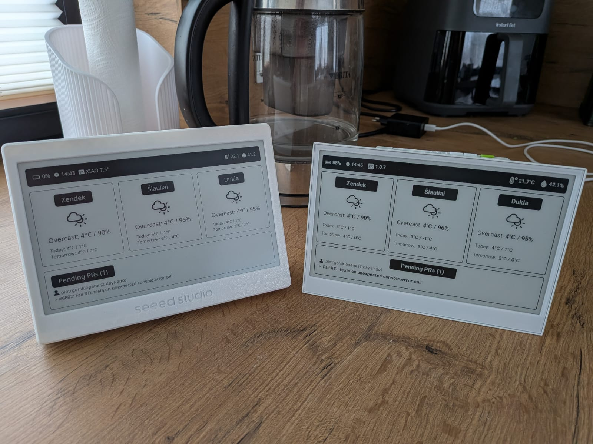

# reTerminal Next.js Dashboard

A dashboard application for displaying weather data and device information. Optimized for eInk screen.



## Setup

### Prerequisites

- Node.js `20.19.0` or newer
- npm `10` or newer

Recommended: Node.js `20.19.0+`.
Required minimum: Node.js `20.9.0+`.

If you use `nvm`:

```bash
nvm use
```

1. Clone the repository and install dependencies:
   ```bash
   npm install
   ```

2. Obtain your SenseCAP HMI credentials:
   - Go to [SenseCAP HMI](https://sensecraft.seeed.cc/hmi)
   - Open your browser's developer tools (F12)
   - Navigate to the Network tab
   - Log in to your account
   - Find the login POST request in the network tab
   - Inspect the request payload to extract your username and password

3. Create a `.env.local` file in the project root and add your credentials:
   ```
   SENSECRAFT_LOGIN_USERNAME=your_username_here
   SENSECRAFT_LOGIN_PASSWORD_ENCODED=your_password_here
   NEXT_PUBLIC_GITHUB_TOKEN=your_github_token_here
   NEXT_PUBLIC_GITHUB_USERNAME=your_github_username_here
   NEXT_PUBLIC_GITHUB_OWNER=your_github_repo_owner_here
   NEXT_PUBLIC_GITHUB_REPO=your_github_repo_name_here
   SENSECRAFT_DEVICE_ID=your_device_id_here
   NEXT_PUBLIC_WEATHER_CITIES=city_name_one,city_name_two,city_name_three
   ```

4. Run the development server:
   ```bash
   npm run dev
   ```

5. Open [http://localhost:3000](http://localhost:3000) to view the dashboard.

## Features

- Weather cards for multiple locations
- Device status card showing battery level, temperature, humidity, and firmware version
- Data fetched from SenseCAP API with server-side rendering
